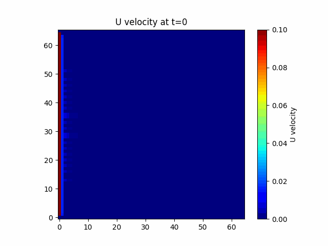
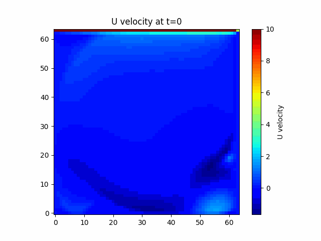

# Neural-Operator-Assisted Differential Solver

This repository explores the use of **Neural Operators**—such as **Fourier Neural Operators (FNO)** and **Spherical Fourier Neural Operators (SFNO)**—for solving fluid-flow governing equations, including:

- Navier–Stokes equations  
- Darcy flow  
- Burgers’ equation  
- Shallow Water equations  

These approaches enable **mesh-independent**, **data-driven** solutions to complex PDEs.

---

## 📌 Fourier Neural Operator (FNO)

### Architecture
The full architecture of the Fourier Neural Operator is shown below:

---

## 🌊 Fluid Flow Simulations Using FNO

### Navier–Stokes Equation Results
Simulation results obtained using FNO for the Navier–Stokes equations:

---

### Flow Over a Dam
**Time evolution of velocity profile** for flow over a dam:

---

### Flow Inside a Tube
**Time evolution of velocity profile** for flow inside a tube:

---

### Lid-Driven Cavity Flow
**Time evolution of velocity profile** in a cavity flow:

---

### Vorticity Formulation (Navier–Stokes)
Solution of the **vorticity formulation** of the Navier–Stokes equations:

---

## 🌍 Spherical Fourier Neural Operator (SFNO)

### Shallow Water Equations on a Sphere
Results using **SFNO** for the **Spherical Shallow Water Equations (SSWE)**:

---

## 🚗 Engineering Application

### Pressure Field Prediction over Car Geometry
Predicted pressure field over a car geometry using neural operator-based models:

---

## 🚀 Key Highlights

- Mesh-free PDE solvers  
- Generalization across resolutions  
- Physics-informed & data-driven learning  
- Applications in fluid dynamics and geophysical flows  
